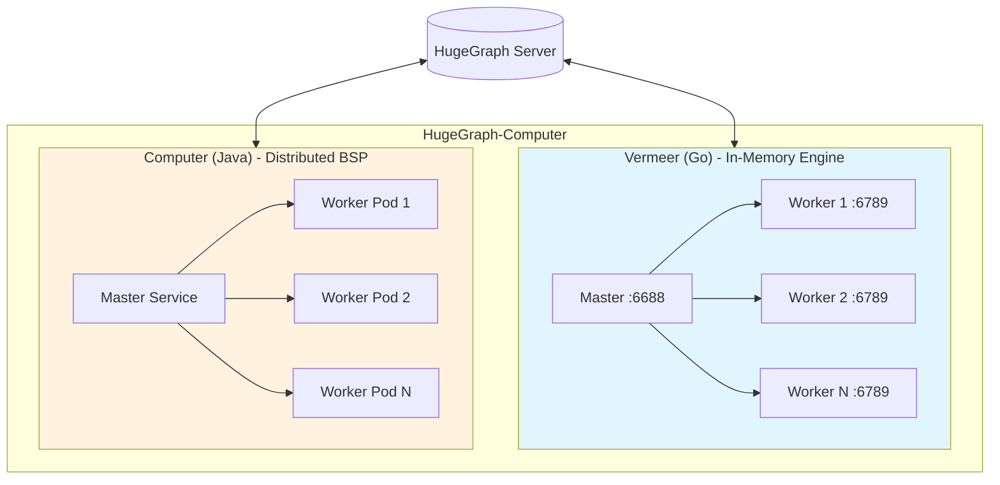
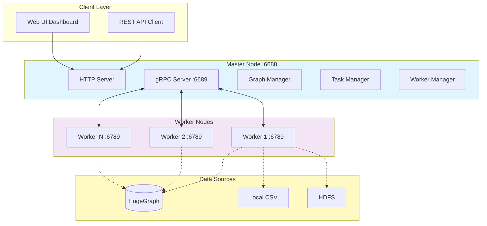

# Apache HugeGraph-Computer

[](https://www.apache.org/licenses/LICENSE-2.0.html)
[](https://github.com/apache/hugegraph-computer/actions/workflows/computer-ci.yml)
[](https://codecov.io/gh/apache/incubator-hugegraph-computer)
[](https://hub.docker.com/repository/docker/hugegraph/hugegraph-computer)
[](https://deepwiki.com/apache/hugegraph-computer)

Apache HugeGraph-Computer is a comprehensive graph computing solution providing two complementary systems for different deployment scenarios:

- **[Vermeer](./vermeer/README.md)** (Go): High-performance in-memory computing engine for single-machine deployments
- **[Computer](./computer/README.md)** (Java): Distributed BSP/Pregel framework for large-scale cluster computing

## Quick Comparison

| Feature | Vermeer (Go) | Computer (Java) |
|---------|--------------|-----------------|
| **Best for** | Quick start, flexible deployment | Large-scale distributed computing |
| **Deployment** | Single binary, multi-node capable | Kubernetes or YARN cluster |
| **Memory model** | In-memory first | Auto spill to disk |
| **Setup time** | Minutes | Hours (requires K8s/YARN) |
| **Algorithms** | 20+ algorithms | 45+ algorithms |
| **Architecture** | Master-Worker | BSP (Bulk Synchronous Parallel) |
| **API** | REST + gRPC | Java API |
| **Web UI** | Built-in dashboard | N/A |
| **Data sources** | HugeGraph, CSV, HDFS | HugeGraph, HDFS |

## Architecture Overview



## Vermeer Architecture (In-Memory Engine)

Vermeer is designed with a Master-Worker architecture optimized for high-performance in-memory graph computing:



**Component Overview:**

| Component | Description |
|-----------|-------------|
| **Master** | Coordinates workers, manages graph metadata, schedules computation tasks via HTTP (:6688) and gRPC (:6689) |
| **Workers** | Execute graph algorithms, store graph partition data in memory, communicate via gRPC (:6789) |
| **REST API** | Graph loading, algorithm execution, result queries (port 6688) |
| **Web UI** | Built-in monitoring dashboard accessible at `/ui/` |
| **Data Sources** | Supports loading from HugeGraph (via gRPC), local CSV files, and HDFS |


## HugeGraph Ecosystem Integration

```
┌─────────────────────────────────────────────────────────────┐
│                    HugeGraph Ecosystem                      │
├─────────────────────────────────────────────────────────────┤
│  ┌─────────────┐    ┌─────────────┐    ┌─────────────────┐  │
│  │   Hubble    │    │  Toolchain  │    │  HugeGraph-AI   │  │
│  │   (UI)      │    │   (Tools)   │    │  (LLM/RAG)      │  │
│  └──────┬──────┘    └──────┬──────┘    └────────┬────────┘  │
│         │                  │                    │           │
│         └──────────────────┼────────────────────┘           │
│                            │                                │
│                    ┌───────▼───────┐                        │
│                    │  HugeGraph    │                        │
│                    │   Server      │                        │
│                    └───────┬───────┘                        │
│                            │                                │
│         ┌──────────────────┼──────────────────┐             │
│         │                  │                  │             │
│  ┌──────▼──────┐    ┌──────▼──────┐    ┌─────▼─────┐       │
│  │  Vermeer    │    │  Computer   │    │   Store   │       │
│  │  (Memory)   │    │  (BSP/K8s)  │    │  (PD)     │       │
│  └─────────────┘    └─────────────┘    └───────────┘       │
└─────────────────────────────────────────────────────────────┘
```

## Getting Started with Vermeer (Recommended)

For quick start and single-machine deployments, we recommend **Vermeer**:

### Docker Quick Start

```bash
# Pull the image
docker pull hugegraph/vermeer:latest

# Run with docker-compose
docker-compose up -d
```

### Binary Quick Start

```bash
# Download and extract (example for Linux AMD64)
wget https://github.com/apache/hugegraph-computer/releases/download/vX.X.X/vermeer-linux-amd64.tar.gz
tar -xzf vermeer-linux-amd64.tar.gz
cd vermeer

# Run master and worker
./vermeer --env=master &
./vermeer --env=worker &
```

See the **[Vermeer README](./vermeer/README.md)** for detailed configuration and usage.

## Getting Started with Computer (Distributed)

For large-scale distributed graph processing on Kubernetes or YARN clusters, see the **[Computer README](./computer/README.md)** for:

- Prerequisites and build instructions
- Kubernetes/YARN deployment guide
- 45+ algorithm implementations
- Custom algorithm development framework

## Supported Algorithms

### Vermeer Algorithms (20+)

| Category | Algorithms |
|----------|-----------|
| **Centrality** | PageRank, Personalized PageRank, Betweenness, Closeness, Degree |
| **Community** | Louvain, Weighted Louvain, LPA, SLPA, WCC, SCC |
| **Path Finding** | SSSP (Dijkstra), BFS Depth |
| **Structure** | Triangle Count, K-Core, K-Out, Clustering Coefficient, Cycle Detection |
| **Similarity** | Jaccard Similarity |

**Features:**
- In-memory optimized implementations
- REST API for algorithm execution
- Real-time result queries

> **Computer (Java) Algorithms**: For Computer's 45+ algorithm implementations including distributed Triangle Count, Rings detection, and custom algorithm development framework, see [Computer Algorithm List](./computer/README.md#available-algorithms).

## When to Use Which

### Choose Vermeer when:

- ✅ Quick prototyping and experimentation
- ✅ Interactive analytics with built-in Web UI
- ✅ Graphs up to hundreds of millions of edges
- ✅ REST API integration requirements
- ✅ Single machine or small cluster with high-memory nodes
- ✅ Sub-second query response requirements

**Performance**: Optimized for fast iteration on medium-sized graphs with in-memory processing. Horizontal scaling by adding worker nodes.

### Choose Computer when:

- ✅ Billions of vertices/edges requiring distributed processing
- ✅ Existing Kubernetes or YARN infrastructure
- ✅ Custom algorithm development with Java
- ✅ Memory-constrained environments (auto disk spill)
- ✅ Integration with Hadoop ecosystem

**Performance**: Handles massive graphs via distributed BSP framework. Batch-oriented with superstep barriers. Elastic scaling on K8s.

## Documentation

- [Project Homepage](https://hugegraph.apache.org/docs/quickstart/hugegraph-computer/)
- [Vermeer Documentation](./vermeer/README.md)
- [Computer Documentation](./computer/README.md)
- [HugeGraph Documentation](https://hugegraph.apache.org/docs/)

## Related Projects

1. [hugegraph](https://github.com/apache/hugegraph) - Graph database core (Server + PD + Store)
2. [hugegraph-toolchain](https://github.com/apache/hugegraph-toolchain) - Graph tools (Loader/Hubble/Tools/Client)
3. [hugegraph-ai](https://github.com/apache/incubator-hugegraph-ai) - Graph AI/LLM/Knowledge Graph system
4. [hugegraph-website](https://github.com/apache/hugegraph-doc) - Documentation and website

## Contributing

Welcome to contribute to HugeGraph-Computer! Please see:

- [How to Contribute](https://hugegraph.apache.org/docs/contribution-guidelines/contribute/) for guidelines
- [GitHub Issues](https://github.com/apache/hugegraph-computer/issues) for bug reports and feature requests

We recommend using [GitHub Desktop](https://desktop.github.com/) to simplify the PR process.

Thank you to all contributors!

[](https://github.com/apache/incubator-hugegraph-computer/graphs/contributors)

## License

HugeGraph-Computer is licensed under [Apache 2.0 License](https://github.com/apache/incubator-hugegraph-computer/blob/master/LICENSE).

## Contact Us

- **GitHub Issues**: [Report bugs or request features](https://github.com/apache/incubator-hugegraph-computer/issues)
- **Email**: [dev@hugegraph.apache.org](mailto:dev@hugegraph.apache.org) ([subscribe first](https://hugegraph.apache.org/docs/contribution-guidelines/subscribe/))
- **Slack**: [Join ASF HugeGraph channel](https://the-asf.slack.com/archives/C059UU2FJ23)
- **WeChat**: Scan QR code to follow Apache HugeGraph official account


