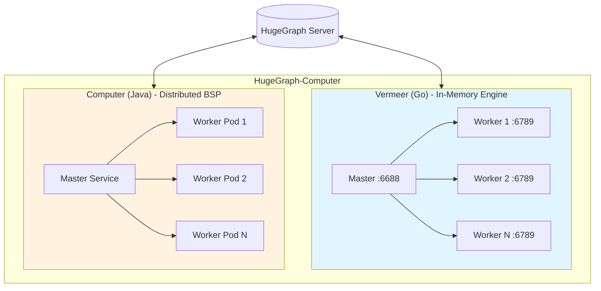

# Apache HugeGraph-Computer

[](https://www.apache.org/licenses/LICENSE-2.0.html)
[](https://github.com/apache/hugegraph-computer/actions/workflows/computer-ci.yml)
[](https://codecov.io/gh/apache/incubator-hugegraph-computer)
[](https://hub.docker.com/repository/docker/hugegraph/hugegraph-computer)
[](https://deepwiki.com/apache/hugegraph-computer)

Apache HugeGraph-Computer is a comprehensive graph computing solution providing two complementary systems for different deployment scenarios:

- **[Vermeer](./vermeer/README.md)** (Go): High-performance in-memory computing engine for single-machine deployments
- **[Computer](./computer/README.md)** (Java): Distributed BSP/Pregel framework for large-scale cluster computing

## Quick Comparison

| Feature | Vermeer (Go) | Computer (Java) |
|---------|--------------|-----------------|
| **Best for** | Single machine, quick start | Large-scale distributed computing |
| **Deployment** | Single binary | Kubernetes or YARN cluster |
| **Memory model** | In-memory first | Auto spill to disk |
| **Setup time** | Minutes | Hours (requires K8s/YARN) |
| **Algorithms** | 20+ algorithms | 45+ algorithms |
| **Architecture** | Master-Worker | BSP (Bulk Synchronous Parallel) |
| **API** | REST + gRPC | Java API |
| **Web UI** | Built-in dashboard | N/A |
| **Data sources** | HugeGraph, CSV, HDFS | HugeGraph, HDFS |

## Architecture Overview



## HugeGraph Ecosystem Integration

```
┌─────────────────────────────────────────────────────────────┐
│                    HugeGraph Ecosystem                      │
├─────────────────────────────────────────────────────────────┤
│  ┌─────────────┐    ┌─────────────┐    ┌─────────────────┐  │
│  │   Hubble    │    │  Toolchain  │    │  HugeGraph-AI   │  │
│  │   (UI)      │    │   (Tools)   │    │  (LLM/RAG)      │  │
│  └──────┬──────┘    └──────┬──────┘    └────────┬────────┘  │
│         │                  │                    │           │
│         └──────────────────┼────────────────────┘           │
│                            │                                │
│                    ┌───────▼───────┐                        │
│                    │  HugeGraph    │                        │
│                    │   Server      │                        │
│                    └───────┬───────┘                        │
│                            │                                │
│         ┌──────────────────┼──────────────────┐             │
│         │                  │                  │             │
│  ┌──────▼──────┐    ┌──────▼──────┐    ┌─────▼─────┐       │
│  │  Vermeer    │    │  Computer   │    │   Store   │       │
│  │  (Memory)   │    │  (BSP/K8s)  │    │  (PD)     │       │
│  └─────────────┘    └─────────────┘    └───────────┘       │
└─────────────────────────────────────────────────────────────┘
```

## Getting Started with Vermeer (Recommended)

For quick start and single-machine deployments, we recommend **Vermeer**:

### Docker Quick Start

```bash
# Pull the image
docker pull hugegraph/vermeer:latest

# Run with docker-compose
docker-compose up -d
```

### Binary Quick Start

```bash
# Download and extract (example for Linux AMD64)
wget https://github.com/apache/hugegraph-computer/releases/download/vX.X.X/vermeer-linux-amd64.tar.gz
tar -xzf vermeer-linux-amd64.tar.gz
cd vermeer

# Run master and worker
./vermeer --env=master &
./vermeer --env=worker &
```

See the **[Vermeer README](./vermeer/README.md)** for detailed configuration and usage.

## Getting Started with Computer (Distributed)

For large-scale distributed graph processing across clusters:

### Prerequisites

- JDK 11 or later
- Maven 3.5+
- Kubernetes cluster or YARN cluster

### Build from Source

```bash
cd computer
mvn clean package -DskipTests
```

### Deploy on Kubernetes

```bash
# Configure your K8s cluster in computer-k8s module
# Submit a graph computing job
java -jar computer-driver.jar --config job-config.properties
```

See the **[Computer README](./computer/README.md)** for detailed deployment and development guide.

## Supported Algorithms

### Common Algorithms (Both Systems)

| Category | Algorithms |
|----------|-----------|
| **Centrality** | PageRank, Personalized PageRank, Betweenness Centrality, Closeness Centrality, Degree Centrality |
| **Community Detection** | Louvain, LPA (Label Propagation), SLPA, WCC (Weakly Connected Components) |
| **Path Finding** | SSSP (Single Source Shortest Path), BFS (Breadth-First Search) |
| **Graph Structure** | Triangle Count, K-Core, Clustering Coefficient, Cycle Detection |
| **Similarity** | Jaccard Similarity |

### Vermeer-Specific Features

- In-memory optimized implementations
- Weighted Louvain variant
- REST API for algorithm execution

### Computer-Specific Algorithms

- Count Triangle (distributed implementation)
- Rings detection
- ClusteringCoefficient variations
- Custom algorithm development framework

See individual README files for complete algorithm lists and usage examples.

## Performance Characteristics

### Vermeer (In-Memory)

- **Throughput**: Optimized for fast iteration on medium-sized graphs (millions of vertices/edges)
- **Latency**: Sub-second query response via REST API
- **Memory**: Requires graph to fit in total worker memory
- **Scalability**: Horizontal scaling by adding worker nodes

### Computer (Distributed BSP)

- **Throughput**: Handles billions of vertices/edges via distributed processing
- **Latency**: Batch-oriented with superstep barriers
- **Memory**: Auto spill to disk when memory is insufficient
- **Scalability**: Elastic scaling on K8s with pod autoscaling

## Use Cases

### When to Use Vermeer

- Quick prototyping and experimentation
- Interactive graph analytics with Web UI
- Medium-scale graphs (up to hundreds of millions of edges)
- Single-machine or small cluster deployments
- REST API integration requirements

### When to Use Computer

- Large-scale batch processing (billions of vertices)
- Existing Kubernetes or YARN infrastructure
- Custom algorithm development with Java
- Memory-constrained environments (auto spill to disk)
- Integration with Hadoop ecosystem

## Documentation

- [Project Homepage](https://hugegraph.apache.org/docs/quickstart/hugegraph-computer/)
- [Vermeer Documentation](./vermeer/README.md)
- [Computer Documentation](./computer/README.md)
- [HugeGraph Documentation](https://hugegraph.apache.org/docs/)

## Related Projects

1. [hugegraph](https://github.com/apache/hugegraph) - Graph database core (Server + PD + Store)
2. [hugegraph-toolchain](https://github.com/apache/hugegraph-toolchain) - Graph tools (Loader/Hubble/Tools/Client)
3. [hugegraph-ai](https://github.com/apache/incubator-hugegraph-ai) - Graph AI/LLM/Knowledge Graph system
4. [hugegraph-website](https://github.com/apache/hugegraph-doc) - Documentation and website

## Contributing

Welcome to contribute to HugeGraph-Computer! Please see:

- [How to Contribute](https://hugegraph.apache.org/docs/contribution-guidelines/contribute/) for guidelines
- [GitHub Issues](https://github.com/apache/hugegraph-computer/issues) for bug reports and feature requests

We recommend using [GitHub Desktop](https://desktop.github.com/) to simplify the PR process.

Thank you to all contributors!

[](https://github.com/apache/incubator-hugegraph-computer/graphs/contributors)

## License

HugeGraph-Computer is licensed under [Apache 2.0 License](https://github.com/apache/incubator-hugegraph-computer/blob/master/LICENSE).

## Contact Us

- **GitHub Issues**: [Report bugs or request features](https://github.com/apache/incubator-hugegraph-computer/issues)
- **Email**: [dev@hugegraph.apache.org](mailto:dev@hugegraph.apache.org) ([subscribe first](https://hugegraph.apache.org/docs/contribution-guidelines/subscribe/))
- **Slack**: [Join ASF HugeGraph channel](https://the-asf.slack.com/archives/C059UU2FJ23)
- **WeChat**: Scan QR code to follow Apache HugeGraph official account


