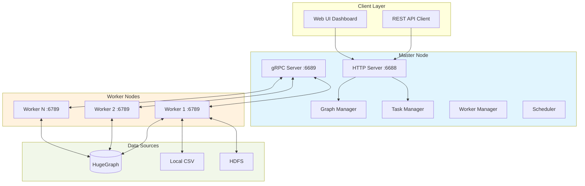

# Vermeer - High-Performance In-Memory Graph Computing

[](https://deepwiki.com/apache/hugegraph-computer)

Vermeer is a high-performance in-memory graph computing platform with a single-binary deployment model. It provides 20+ graph algorithms, custom algorithm extensions, and seamless integration with HugeGraph.

## Key Features

- **Single Binary Deployment**: Zero external dependencies, run anywhere
- **In-Memory Performance**: Optimized for fast iteration on medium to large graphs
- **Master-Worker Architecture**: Horizontal scalability by adding worker nodes
- **REST API + gRPC**: Easy integration with existing systems
- **Web UI Dashboard**: Built-in monitoring and job management
- **Multi-Source Support**: HugeGraph, local CSV, HDFS
- **20+ Graph Algorithms**: Production-ready implementations

## Architecture



### Directory Structure

```
vermeer/
├── main.go              # Single binary entry point
├── Makefile             # Build automation
├── algorithms/          # 20+ algorithm implementations
│   ├── pagerank.go
│   ├── louvain.go
│   ├── sssp.go
│   └── ...
├── apps/
│   ├── master/          # Master service
│   │   ├── services/    # HTTP handlers
│   │   ├── workers/     # Worker management
|   |   ├── schedules/    # Task scheduling strategies
│   │   └── tasks/       # Task scheduling
│   ├── compute/         # Worker-side compute logic
│   ├── graphio/         # Graph I/O (HugeGraph, CSV, HDFS)
│   │   └── hugegraph.go # HugeGraph integration
│   ├── protos/          # gRPC definitions
│   └── common/          # Utilities, logging, metrics
├── config/              # Configuration templates
│   ├── master.ini
│   └── worker.ini
├── tools/               # Binary dependencies (supervisord, protoc)
└── ui/                  # Web dashboard
```

## Quick Start

### Option 1: Docker (Recommended)

Pull the image:

```bash
docker pull hugegraph/vermeer:latest
```

Create a dedicated config directory (e.g., `~/vermeer-config/`) with `master.ini` and `worker.ini` files (see [Configuration](#configuration) section).

Run with Docker:

```bash
# Master node
docker run -v ~/vermeer-config:/go/bin/config hugegraph/vermeer --env=master

# Worker node
docker run -v ~/vermeer-config:/go/bin/config hugegraph/vermeer --env=worker
```

> **Security Note**: Only mount directories containing Vermeer configuration files. Avoid mounting your entire home directory to minimize security risks.

#### Docker Compose

Update `master_peer` in `~/worker.ini` to `172.20.0.10:6689`, and edit ``docker-compose.yml`` to mount your config directory:

```yaml
    volumes:
      - ~/:/go/bin/config # Change here to your actual config path
```

```bash
docker-compose up -d
```

### Option 2: Binary Download

```bash
# Download binary (replace version and platform)
wget https://github.com/apache/hugegraph-computer/releases/download/vX.X.X/vermeer-linux-amd64.tar.gz
tar -xzf vermeer-linux-amd64.tar.gz
cd vermeer

# Run master and worker
./vermeer --env=master &
./vermeer --env=worker &
```

The `--env` parameter specifies the configuration file name in the `config/` folder (e.g., `master.ini`, `worker.ini`).

#### Using the Shell Script

Configure parameters in `vermeer.sh`, then:

```bash
./vermeer.sh start master
./vermeer.sh start worker
```

### Option 3: Build from Source

#### Prerequisites

- Go 1.23 or later
- `curl` and `unzip` utilities (for downloading dependencies)
- Internet connection (for first-time setup)

#### Build Steps

**Recommended**: Use Makefile:

```bash
# First-time setup (downloads supervisord and protoc binaries)
make init

# Build for current platform
make

# Or build for specific platform
make build-linux-amd64
make build-linux-arm64
```

**Alternative**: Use build script:

```bash
# Auto-detect platform
./build.sh

# Or specify architecture
./build.sh amd64
./build.sh arm64
```

#### Development Build

For development with hot-reload of web UI:

```bash
go build -tags=dev
```

#### Clean Build Artifacts

```bash
make clean      # Remove binaries and generated assets
make clean-all  # Also remove downloaded tools (supervisord, protoc)
```

## Configuration

### Master Configuration (`master.ini`)

```ini
[default]
# Master HTTP listen address
http_peer = 0.0.0.0:6688

# Master gRPC listen address
grpc_peer = 0.0.0.0:6689

# Master peer address (self-reference for workers)
master_peer = 127.0.0.1:6689

# Run mode
run_mode = master

# Task scheduling strategy
task_strategy = 1

# Number of parallel tasks
task_parallel_num = 1
```

**Note**: HugeGraph connection details (`pd_peers`, `server`, `graph`) are provided in the graph load API request, not in the configuration file. See [HugeGraph Integration](#hugegraph-integration) section for details.

### Worker Configuration (`worker.ini`)

```ini
[default]
# Worker HTTP listen address
http_peer = 0.0.0.0:6788

# Worker gRPC listen address
grpc_peer = 0.0.0.0:6789

# Master gRPC address to connect
master_peer = 127.0.0.1:6689

# Run mode
run_mode = worker

# Worker group identifier
worker_group = default
```

## Available Algorithms

| Algorithm | Category | Description |
|-----------|----------|-------------|
| **PageRank** | Centrality | Measures vertex importance via link structure |
| **Personalized PageRank** | Centrality | PageRank from specific source vertices |
| **Betweenness Centrality** | Centrality | Measures vertex importance via shortest paths |
| **Closeness Centrality** | Centrality | Measures average distance to all other vertices |
| **Degree Centrality** | Centrality | Simple in/out degree calculation |
| **Louvain** | Community Detection | Modularity-based community detection |
| **Louvain (Weighted)** | Community Detection | Weighted variant for edge-weighted graphs |
| **LPA** | Community Detection | Label Propagation Algorithm |
| **SLPA** | Community Detection | Speaker-Listener Label Propagation |
| **WCC** | Community Detection | Weakly Connected Components |
| **SCC** | Community Detection | Strongly Connected Components |
| **SSSP** | Path Finding | Single Source Shortest Path (Dijkstra) |
| **Triangle Count** | Graph Structure | Counts triangles in the graph |
| **K-Core** | Graph Structure | Finds k-core subgraphs |
| **K-Out** | Graph Structure | K-degree filtering |
| **Clustering Coefficient** | Graph Structure | Measures local clustering |
| **Cycle Detection** | Graph Structure | Detects cycles in directed graphs |
| **Jaccard Similarity** | Similarity | Computes neighbor-based similarity |
| **Depth (BFS)** | Traversal | Breadth-First Search depth assignment |

## API Overview

Vermeer exposes a REST API on port `6688` (configurable in `master.ini`).

### Key Endpoints

| Endpoint | Method | Description |
|----------|--------|-------------|
| `/api/v1/graphs` | POST | Load graph from data source |
| `/api/v1/graphs/{graph_id}` | GET | Get graph metadata |
| `/api/v1/graphs/{graph_id}` | DELETE | Unload graph from memory |
| `/api/v1/compute` | POST | Execute algorithm on loaded graph |
| `/api/v1/tasks/{task_id}` | GET | Get task status and results |
| `/api/v1/workers` | GET | List connected workers |
| `/ui/` | GET | Web UI dashboard |

### Example: Run PageRank

```bash
# 1. Load graph from HugeGraph
curl -X POST http://localhost:6688/api/v1/graphs \
  -H "Content-Type: application/json" \
  -d '{
    "graph_name": "my_graph",
    "load_type": "hugegraph",
    "hugegraph": {
      "pd_peers": ["127.0.0.1:8686"],
      "graph_name": "hugegraph"
    }
  }'

# 2. Run PageRank
curl -X POST http://localhost:6688/api/v1/compute \
  -H "Content-Type: application/json" \
  -d '{
    "graph_name": "my_graph",
    "algorithm": "pagerank",
    "params": {
      "max_iterations": 20,
      "damping_factor": 0.85
    },
    "output": {
      "type": "hugegraph",
      "property_name": "pagerank_value"
    }
  }'

# 3. Check task status
curl http://localhost:6688/api/v1/tasks/{task_id}
```

### OLAP vs OLTP Modes

- **OLAP Mode**: Load entire graph into memory, run multiple algorithms
- **OLTP Mode**: Query-driven, load subgraphs on demand (planned feature)

## Data Sources

### HugeGraph Integration

Vermeer integrates with HugeGraph via:

1. **Metadata Query**: Queries HugeGraph PD (metadata service) via gRPC for partition information
2. **Data Loading**: Streams vertices/edges from HugeGraph Store via gRPC (`ScanPartition`)
3. **Result Writing**: Writes computed results back via HugeGraph REST API (adds vertex properties)

Configuration in graph load request:

```json
{
  "load_type": "hugegraph",
  "hugegraph": {
    "pd_peers": ["127.0.0.1:8686"],
    "graph_name": "hugegraph",
    "vertex_label": "person",
    "edge_label": "knows"
  }
}
```

### Local CSV Files

Load graphs from local CSV files:

```json
{
  "load_type": "csv",
  "csv": {
    "vertex_file": "/path/to/vertices.csv",
    "edge_file": "/path/to/edges.csv",
    "delimiter": ","
  }
}
```

### HDFS

Load from Hadoop Distributed File System:

```json
{
  "load_type": "hdfs",
  "hdfs": {
    "namenode": "hdfs://namenode:9000",
    "vertex_path": "/graph/vertices",
    "edge_path": "/graph/edges"
  }
}
```

## Developing Custom Algorithms

Custom algorithms implement the `Algorithm` interface in `algorithms/algorithms.go`:

> **NOTE**: The following is a simplified conceptual interface for illustration purposes.
> For actual algorithm implementation, see the `WorkerComputer` and `MasterComputer` interfaces defined in `apps/compute/api.go`.

```go
type Algorithm interface {
    // Initialize the algorithm
    Init(params map[string]interface{}) error

    // Compute one iteration for a vertex
    Compute(vertex *Vertex, messages []Message) (halt bool, outMessages []Message)

    // Aggregate global state (optional)
    Aggregate() interface{}

    // Check termination condition
    Terminate(iteration int) bool
}
```

### Example: Simple Degree Count

> **NOTE**: This is a simplified conceptual example. Actual algorithms must implement the `WorkerComputer` interface.
> See `vermeer/algorithms/degree.go` for a working example.

```go
package algorithms

type DegreeCount struct {
    maxIter int
}

func (dc *DegreeCount) Init(params map[string]interface{}) error {
    dc.maxIter = params["max_iterations"].(int)
    return nil
}

func (dc *DegreeCount) Compute(vertex *Vertex, messages []Message) (bool, []Message) {
    // Store degree as vertex value
    vertex.SetValue(float64(len(vertex.OutEdges)))

    // Halt after first iteration
    return true, nil
}

func (dc *DegreeCount) Terminate(iteration int) bool {
    return iteration >= dc.maxIter
}
```

Register the algorithm in `algorithms/algorithms.go`:

```go
func init() {
    RegisterAlgorithm("degree_count", &DegreeCount{})
}
```

## Memory Management

Vermeer uses an in-memory-first approach:

1. **Graph Loading**: Vertices and edges are distributed across workers and stored in memory
2. **Automatic Partitioning**: Master assigns partitions to workers based on capacity
3. **Memory Monitoring**: Workers report memory usage to master
4. **Graceful Degradation**: If memory is insufficient, algorithms may fail (disk spilling not yet implemented)

**Best Practice**: Ensure total worker memory exceeds graph size by 2-3x for algorithm workspace.

## Supervisord Integration

Run Vermeer as a daemon with automatic restarts and log rotation:

```bash
# Configuration in config/supervisor.conf
./tools/supervisord -c config/supervisor.conf -d
```

Sample supervisor configuration:

```ini
[program:vermeer-master]
command=/path/to/vermeer --env=master
autostart=true
autorestart=true
stdout_logfile=/var/log/vermeer-master.log
```

## Protobuf Development

If you modify `.proto` files, regenerate Go code:

```bash
# Install protobuf Go plugins
go install google.golang.org/protobuf/cmd/protoc-gen-go@v1.28.0
go install google.golang.org/grpc/cmd/protoc-gen-go-grpc@v1.2.0

# Generate (adjust protoc path for your platform)
vermeer/tools/protoc/linux64/protoc vermeer/apps/protos/*.proto --go-grpc_out=vermeer/apps/protos/. --go_out=vermeer/apps/protos/. # please note remove license header if any
```

## Performance Tuning

### Master Configuration

- **task_parallel_num**: Number of parallel tasks (default: 1). Increase for better task scheduling throughput.

### Algorithm-Specific

- **PageRank**: Use `damping_factor=0.85`, `tolerance=0.0001` for faster convergence
- **Louvain**: Enable `weighted=true` only if edge weights are meaningful
- **SSSP**: Provide source vertex ID for single-source queries

## Monitoring

Access the Web UI dashboard at `http://master-ip:6688/ui/` for:

- Worker status and resource usage
- Active and completed tasks
- Graph metadata and statistics
- Real-time logs

## Troubleshooting

### Workers Not Connecting

- Verify `master_peer` in `worker.ini` matches master's gRPC address
- Check firewall rules for port `6689` (gRPC)
- Ensure master is running before starting workers

### Out of Memory Errors

- Reduce graph size or increase worker memory
- Distribute graph across more workers
- Use algorithms with lower memory footprint (e.g., degree centrality vs. betweenness)

### Slow Algorithm Execution

- Increase `compute_threads` in worker config
- Check network latency between master and workers
- Profile algorithm with built-in metrics (access via API)

## Links

- [Project Homepage](https://hugegraph.apache.org/docs/quickstart/hugegraph-computer/)
- [Main README](../README.md)
- [Computer (Java) README](../computer/README.md)
- [GitHub Issues](https://github.com/apache/hugegraph-computer/issues)
- [Docker Hub](https://hub.docker.com/r/hugegraph/vermeer)

## Contributing

See the main [Contributing Guide](../README.md#contributing) for how to contribute to Vermeer.

## License

Vermeer is part of Apache HugeGraph-Computer, licensed under [Apache 2.0 License](https://github.com/apache/incubator-hugegraph-computer/blob/master/LICENSE).
