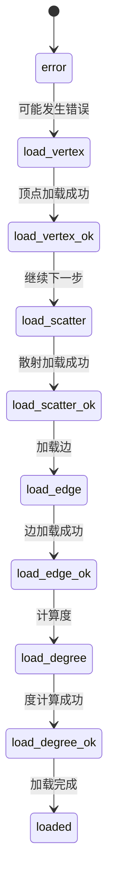
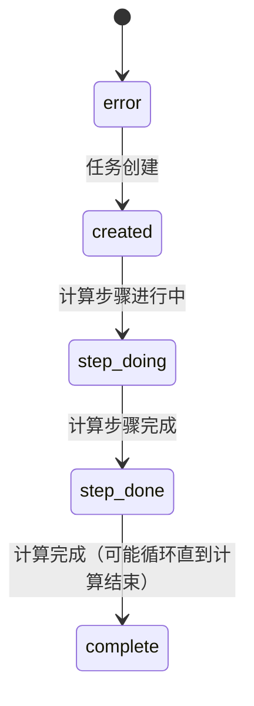
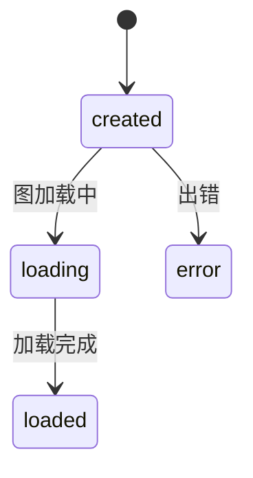

# Vermeer API Documentation

## 1\. Installation and Deployment

### 1.1 Run Configuration

The computing framework has two roles, worker and master, but only one executable file, which is set by run\_mode (master/worker). The --env parameter can specify which configuration file to use, for example, --env=master specifies to use master.ini, and the configuration file is placed in the config/ directory. The master needs to specify the listening port number, and the worker needs to specify the listening port number and the master's ip:port.

| Configuration items | illustrate | Example |
| --- | --- | --- |
| log\_level | Log Level | debug/info/warn/error |
| debug\_mode | debug mode | release |
| http\_peer | http listening address | 0.0.0.0:6688 |
| grpc\_peer | grpc listening address | 0.0.0.0:6689 |
| master\_peer | master grpc address | 127.0.0.1:6689 |
| run\_mode | Operation Mode | master/worker |

Running the example:

```bash
./vermeer --env=master
./vermeer --env=worker01
```

### 1.2 Authentication Access

Vermeer has enabled authentication access by default since version 0.2.0. All http requests to access the Vermeer interface need to carry a valid token. Requests without a valid token will be denied access to the service. The token is provided by the Vermeer development side. When used, add the Authorization field in the request Headers.

Postman example:

```
Host: <calculated when request is sent>
User-Agent: PostmanRuntime/7.29.4
Accept: gzip,deflate,br
Accept-Encoding: gzip,deflate,br
Connection: keep-alive
Authorization: 2Bq2ToHwLnci5wAyvXbhhYwz1YJhb4QLt1P2ttmfD...
```

Go example:

```go
func setAuth(request *http.Request, token string) {
    request.Header.Set("Authorization", token)
}
```

## 2\. Task creation class REST API

### 2.1 General Description

This type of REST API provides all the functions for creating tasks, including reading graph data and various computing functions. It provides two interfaces: asynchronous return and synchronous return. The returned content contains the information of the created task. The overall process of using Vermeer is to first create a task to read the graph, and then create a computing task to perform the calculation after the graph is read. The graph will not be deleted automatically. There is no need to read it repeatedly to run multiple computing tasks on a graph. If you need to delete it, you can use the graph deletion interface. For computing type tasks, you can iterate and batch obtain the calculation results through the 4.8 interface. The task status is divided into the reading task status and the computing task status. The client usually only needs to understand the four states of creation, task in progress, task end, and task error. The graph status is the basis for judging whether the graph is available. If the graph is being read or the graph status is wrong, the graph cannot be used to create a computing task. The graph deletion interface is only available in the loaded and error states and there is no computing task for the graph.

Asynchronous return interface: `POST http://master_ip:port/tasks/create` , only returns whether the task creation is successful. You need to actively query the task status to determine whether it is completed. Synchronous return interface: `POST http://master_ip:port/tasks/create/sync` , returns after the task is completed.

| parameter | Is this field required? | type | default value | Value range | Remark |
| --- | --- | --- | --- | --- | --- |
| task\_type | 是 | string | \- | load/compute | Task Type |
| graph | 是 | string | \- | \- | Figure name |
| params | 否 | json | {} | \- | Dynamic parameters, see related tasks for specific parameters |

Load task status:



Compute task status:



Figure Status:



### 2.2 Loading graph data

Supports the new reload feature, which allows you to reload the graph to update the graph data. Set "task\_type": "reload". If you do not fill in the params parameter, the default is to use the parameters of the last graph loading task to reload. If you fill in the parameters, the existing parameters will be overwritten. The prerequisite is that the graph must already exist. The graph vertex data is stored in the disk database by default. For small data volumes (<100 million), if you need faster calculation speed, you can change "load.vertex\_backend" to "mem".

Asynchronous return interface: `POST http://master_ip:port/tasks/create` Synchronous return interface: `POST http://master_ip:port/tasks/create/sync`

| parameter | Is this field required? | type | default value | Value range | Remark |
| --- | --- | --- | --- | --- | --- |
| task\_type | 是 | string | \- | load/reload | Task Type |
| graph | 是 | string | \- | \- | Figure name |
| params | 否 | json | {} | \- | Dynamic parameters, see the table below for specific parameters |

| Dynamic parameters | Is this field required? | type | default value | Value range | Remark |
| --- | --- | --- | --- | --- | --- |
| load.parallel | 否 | int | 1 | Greater than 0 | Loading Thread |
| load.type | 否 | string | local | local/hdfs/afs/hugegraph | Data loading method |
| load.edges\_per\_vertex | 否 | int | 10 | Greater than or equal to 0 | Each vertex is estimated, affecting loading speed |
| load.edge\_files | Required for local/hdfs/afs mode | string | \- | \- | Edge file name. The local method requires specifying the worker IP address, such as {"10.81.116.77":"e\_00"}. The hdfs/afs method supports wildcards, such as "/data/twitter-2010.e\_\*" |
| load.use\_property | 否 | int | 0 | 0/1 | Whether to use attributes |
| load.vertex\_property | No (read data from hugegraph, if load.use\_property=1, you must specify property, this item is required) | json | \- | \- | Vertex attributes, in JSON format, example: {"label": "2,0", "name": "..." }; hugegraph reads as a string, example: "1,2,10001" |
| load.edge\_property | No (read data from hugegraph, if load.use\_property=1, you must specify property, this item is required) | json | \- | \- | Edge attributes, in JSON format, example: {"label": "2,0", "name": "..." }; when hugegraph is read, it is a string, example: "1,2,10001" |
| load.use\_outedge | 否 | int | 0 | 0/1 | Whether to generate vertex out-edge data |
| load.use\_out\_degree | 否 | int | 0 | 0/1 | Whether to generate vertex out-degree data |
| load.use\_undirected | 否 | int | 0 | 0/1 | Whether to generate undirected graph data |
| load.vertex\_backend | 否 | string | db | db/mem | Vertex underlying storage method, small data volume (<100 million) can be set to mem |
| load.delimiter | 否 | string | Space | \- | Import file column delimiter |
| load.hdfs\_conf\_path | Required for HDFS read | string | \- | \- | hdfs configuration file path |
| load.hdfs\_namenode | Required for HDFS read | string | \- | \- | hdfs namenode |
| load.hdfs\_use\_krb | 否 | int | 0 | 0/1 | Whether to use Keberos authentication |
| load.krb\_name | 否 | string | \- | \- | Keberos Username |
| load.krb\_realm | 否 | string | \- | \- | Keberos realm |
| load.krb\_conf\_path | 否 | string | \- | \- | Keberos configuration file path |
| load.krb\_keytab\_path | 否 | string | \- | \- | Keberos keytab path |
| load.hg\_pd\_peers | Required for hugegraph reading | string | \- | \- | The peers of the hugegraph pd that imports data, example: \["10.14.139.69:8686"\] |
| load.hugegraph\_name | Required for hugegraph reading | string | \- | \- | Hugegraph name of the imported data |
| load.hugegraph\_username | Required for hugegraph reading | string | \- | \- | Hugegraph username for importing data |
| load.hugegraph\_password | Required for hugegraph reading | string | \- | \- | hugegraph password for importing data |
| load.hugegraph\_vertex\_condition | 否 | string | \- | \- | Import vertex number filter statement, example: "element.id > 100", string meaning is Boolean expression |
| load.hugegraph\_edge\_condition | 否 | string | \- | \- | Import edge number filter statement, example: "element.weight > 0.5", string meaning is boolean expression |
| load.hg\_partitions | 否 | string | \- | \- | Import hugestore partitions. Example: "load.hg\_partitions": "0,1,2", pull partitions with id 0, 1, 2; if not configured, pull all partitions |
| load.hugestore\_batch\_timeout | 否 | int | 120 | \>=60 | Timeout for importing a batch into hugestore |
| load.hugestore\_batchsize | 否 | int | 100000 | \>0 | The size of a batch to pull when importing |
| load.afs\_uri | AFS read required | string | \- | \- | AFS cluster URI for importing data |
| load.afs\_username | AFS read required | string | \- | \- | AFS username for importing data |
| load.afs\_password | AFS read required | string | \- | \- | AFS password for importing data |
| load.afs\_config\_path | 否 | string | \- | \- | afs-api configuration file path, generally no need to change |

Request example:

```json
// load.type: local
POST http://10.81.116.77:8688/tasks/create
{
    "task_type": "load",
    "graph": "testdb",
    "params": {
        "load.parallel": "50",
        "load.type": "local",
        "load.vertex_files": "{\"10.81.116.77\":\"data/twitter-2010.v_[0,99]\"}",
        "load.edge_files": "{\"10.81.116.77\":\"data/twitter-2010.e_[0,99]\"}",
        "load.use_out_degree": "1",
        "load.use_outedge": "1"
    }
}
```

```json
// load.type: hdfs
POST http://10.81.116.77:8688/tasks/create
{
    "task_type": "load",
    "graph": "testdb",
    "params": {
        "load.parallel": "50",
        "load.type": "hdfs",
        "load.vertex_files": "/data/twitter-2010.v_*",
        "load.edge_files": "/data/twitter-2010.e_*",
        "load.hdfs_namenode": "hdfs://10.81.116.77:8020",
        "load.hdfs_conf_path": "/home/hadoop/hadoop-3.3.1/etc/hadoop/",
        "load.hdfs_use_krb": "0",
        "load.krb_realm": "",
        "load.krb_name": "",
        "load.krb_keytab_path": "",
        "load.krb_conf_path": "",
        "load.use_out_degree": "1",
        "load.use_outedge": "1"
    }
}
```

```json
// load.type: afs
POST http://10.81.116.77:8688/tasks/create
{
    "task_type": "load",
    "graph": "testdb",
    "params": {
        "load.parallel": "50",
        "load.type": "afs",
        "load.vertex_files": "/user/vermeer_test/twitter-2010.v_*",
        "load.edge_files": "/user/vermeer_test/twitter-2010.e_*",
        "load.afs_username": "test",
        "load.afs_password": "xxxxxx",
        "load.afs_uri": "afs://wudang.afs.baidu.com:9902/",
        "load.use_out_degree": "1",
        "load.use_outedge": "1"
    }
}
```

```json
// load.type: hugegraph
POST http://10.81.116.77:8688/tasks/create
{
    "task_type": "load",
    "graph": "testdb",
    "params": {
        "load.parallel": "50",
        "load.type": "hugegraph",
        "load.hg_pd_peers": "[\"10.14.139.69:8686\"]",
        "load.hugegraph_name": "DEFAULT/hugegraph2/g",
        "load.hugegraph_password":"xxxxx",
        "load.use_out_degree": "1",
        "load.use_outedge": "1"
    }
}
```

```json
// reload
POST http://10.81.116.77:8688/tasks/create
{
    "task_type": "reload",
    "graph": "testdb"
}
```

### 2.3 Output calculation result description

All computing tasks (only examples showing local output) support multiple result output methods, and you can customize the output method: local, hdfs, afs or hugegraph. Add the corresponding parameters to the params parameter when sending the request to take effect. Support the output of statistical information of the calculation results. You need to specify output.need\_statistics as 1, and the results will be written in the interface task information. The statistical mode operator currently supports "count" and "modularity", but it is only applicable to the community discovery algorithm.

| Dynamic parameters | Is this field required? | type | default value | Value range |
| --- | --- | --- | --- | --- |
| output.parallel | 否 | int | 1 | Greater than 0 |
| output.delimiter | 否 | string | Space | \- |
| output.file\_path | Required for local/hdfs/afs mode | string | \- | \- |
| output.type | 是 | string | local | local/hdfs/afs/hugegraph |
| output.need\_query | 否 | int | 0 | 0/1 |
| output.hdfs\_conf\_path | HDFS mode is required | string | \- | \- |
| output.hdfs\_namenode | HDFS mode is required | string | \- | \- |
| output.hdfs\_use\_krb | 否 | int | 0 | 0/1 |
| output.krb\_name | 否 | string | \- | \- |
| output.krb\_realm | 否 | string | \- | \- |
| output.krb\_conf\_path | 否 | string | \- | \- |
| output.krb\_keytab\_path | 否 | string | \- | \- |
| output.afs\_uri | afs mode required | string | \- | \- |
| output.afs\_username | afs mode required | string | \- | \- |
| output.afs\_password | afs mode required | string | \- | \- |
| output.afs\_config\_path | 否 | string | \- | \- |
| output.hg\_pd\_peers | Hugegraph mode is required | string | \- | \- |
| output.hugegraph\_name | Hugegraph mode is required | string | \- | \- |
| output.hugegraph\_username | Hugegraph mode is required | string | \- | \- |
| output.hugegraph\_password | Hugegraph mode is required | string | \- | \- |
| output.hugegraph\_property | Hugegraph mode is required | string | \- | \- |
| output.hugegraph\_write\_type | 否 | string | OLAP\_COMMON | OLAP\_COMMON / OLAP\_SECONDARY / OLAP\_RANGE |
| output.need\_statistics | 否 | int | 0 | 0/1 |
| output.statistics\_mode | 否 | string | \- | count/modularity |

Example:

```json
// local
POST http://10.81.116.77:8688/tasks/create
{
    "task_type": "compute",
    "graph": "testdb",
    "params": {
        "compute.algorithm": "pagerank",
        "compute.parallel":"10",
        "compute.max_step":"10",
        "output.type":"local",
        "output.parallel":"1",
        "output.file_path":"result/pagerank"
    }
}
```

```json
// hdfs
POST http://10.81.116.77:8688/tasks/create
{
    "task_type": "compute",
    "graph": "testdb",
    "params": {
        "compute.algorithm": "pagerank",
        "compute.parallel":"10",
        "compute.max_step":"10",
        "output.type":"hdfs",
        "output.parallel":"1",
        "output.file_path":"data/result/pagerank",
        "output.hdfs_namenode": "hdfs://10.81.116.77:8020",
        "output.hdfs_conf_path": "/home/hadoop/etc/hadoop",
        "output.hdfs_use_krb": "0"
    }
}
```

```json
// afs
POST http://10.81.116.77:8688/tasks/create
{
    "task_type": "compute",
    "graph": "testdb",
    "params": {
        "compute.algorithm": "pagerank",
        "compute.parallel":"10",
        "compute.max_step":"10",
        "output.type":"afs",
        "output.parallel":"1",
        "output.file_path":"/user/vermeer_test/result/pagerank",
        "output.afs_username": "test",
        "output.afs_password": "xxxxxx",
        "output.afs_uri": "afs://wudang.afs.baidu.com:9902/"
    }
}
```

```json
// hugegraph
POST http://10.81.116.77:8688/tasks/create
{
    "task_type": "compute",
    "graph": "testdb",
    "params": {
        "compute.algorithm": "pagerank",
        "compute.parallel":"10",
        "compute.max_step":"10",
        "output.type":"hugegraph",
        "output.parallel":"10",
        "output.hg_pd_peers": "[\"10.14.139.69:8686\"]",
        "output.hugegraph_username":"admin", 
        "output.hugegraph_password":"xxxxx",
        "output.hugegraph_name": "DEFAULT/hugegraph0/g",
        "output.hugegraph_property": "pagerank"
    }
}
```

### 2.4 PageRank

The PageRank algorithm, also known as the web page ranking algorithm, reflects the relevance and importance of web pages (nodes) by calculating the hyperlinks between web pages (nodes). It is suitable for scenarios such as web page sorting and discovering key figures in social networks. If a web page is linked to by many other web pages, its PageRank value is high; when a web page with a high PageRank value links to other web pages, the PageRank value of the linked web page will be correspondingly increased.

Asynchronous return interface: `POST http://master_ip:port/tasks/create` Synchronous return interface: `POST http://master_ip:port/tasks/create/sync`

| parameter | Is this field required? | type | default value | Value range | Remark |
| --- | --- | --- | --- | --- | --- |
| task\_type | 是 | string | \- | compute | Task Type |
| graph | 是 | string | \- | \- | Figure name |
| params | 否 | json | {} | \- | Dynamic parameters, see the table below for specific parameters |

| Dynamic parameters | Is this field required? | type | default value | Value range | Remark |
| --- | --- | --- | --- | --- | --- |
| compute.algorithm | 是 | string | \- | pagerank | Algorithm Name |
| compute.parallel | 否 | int | 1 | Greater than 0 | Worker count threads |
| compute.max\_step | 否 | int | 10 | Greater than 0 | Maximum number of iterations |
| pagerank.damping | 否 | float | 0.85 | 0 - 1 | Damping coefficient, the percentage of transmission to the next point |
| pagerank.diff\_threshold | 否 | float | 0.00001 | 0 - 1 | Convergence accuracy, the upper limit of the absolute value accumulation and change of each point in each iteration. The algorithm stops when it is less than this value. |

```json
POST http://10.81.116.77:8688/tasks/create
{
    "task_type": "compute",
    "graph": "testdb",
    "params": {
        "compute.algorithm": "pagerank",
        "compute.parallel":"10",
        "output.type":"local",
        "output.parallel":"1",
        "output.file_path":"result/pagerank",
        "compute.max_step":"10"
    }
}
```

### 2.5 WCC (weakly connected component)

Calculate all connected subgraphs in an undirected graph and output the weakly connected subgraph id to which each vertex belongs, which is used to indicate the connectivity between each point and distinguish different connected communities.

Asynchronous return interface: `POST http://master_ip:port/tasks/create` Synchronous return interface: `POST http://master_ip:port/tasks/create/sync`

| Dynamic parameters | Is this field required? | type | default value | Value range | Remark |
| --- | --- | --- | --- | --- | --- |
| compute.algorithm | 是 | string | \- | wcc | Algorithm Name |
| compute.parallel | 否 | int | 1 | Greater than 0 | Worker count threads |
| compute.max\_step | 否 | int | 10 | Greater than 0 | Maximum number of iterations |

```json
POST http://10.81.116.77:8688/tasks/create
{
    "task_type": "compute",
    "graph": "testdb",
    "params": {
        "compute.algorithm": "wcc",
        "compute.parallel":"10",
        "output.type":"local",
        "output.parallel":"1",
        "output.file_path":"result/wcc",
        "compute.max_step":"10"
    }
}
```

### 2.6 LPA (Label Propagation)

The label transfer algorithm is a graph clustering algorithm that is often used to discover potential communities in social networks.

Asynchronous return interface: `POST http://master_ip:port/tasks/create` Synchronous return interface: `POST http://master_ip:port/tasks/create/sync`

| Dynamic parameters | Is this field required? | type | default value | Value range | Remark |
| --- | --- | --- | --- | --- | --- |
| compute.algorithm | 是 | string | \- | lpa | Algorithm Name |
| compute.parallel | 否 | int | 1 | Greater than 0 | Worker count threads |
| compute.max\_step | 否 | int | 10 | Greater than 0 | Maximum number of iterations |
| lpa.vertex\_weight\_property | 否 | string | \- | Vertex weight attribute name, must be int or float |  |

```json
POST http://10.81.116.77:8688/tasks/create
{
    "task_type": "compute",
    "graph": "testdb",
    "params": {
        "compute.algorithm": "lpa",
        "compute.parallel":"10",
        "output.type":"local",
        "output.parallel":"1",
        "output.file_path":"result/lpa",
        "compute.max_step":"10"
    }
}
```

### 2.7 Degree Centrality

This algorithm is used to calculate the degree centrality value of each node in the graph, and supports both undirected and directed graphs. In undirected graphs, the degree centrality is calculated based on the edge information and the number of node occurrences; in directed graphs, the in-degree value or out-degree value of the node is obtained by filtering according to the direction of the edge and counting the number of node occurrences based on the input edge or output edge information. The more edges a node has with other nodes, the larger the degree centrality value is, and the higher its importance in the graph.

Asynchronous return interface: `POST http://master_ip:port/tasks/create` Synchronous return interface: `POST http://master_ip:port/tasks/create/sync`

| Dynamic parameters | Is this field required? | type | default value | Value range | Remark |
| --- | --- | --- | --- | --- | --- |
| compute.algorithm | 是 | string | \- | degree | Algorithm Name |
| compute.parallel | 否 | int | 1 | Greater than 0 | Worker count threads |
| degree.direction | 否 | string | out | out/in/both | Edge direction |
| compute.max\_step | 否 | int | 10 | Greater than 0 | Maximum number of iterations |

```json
POST http://10.81.116.77:8688/tasks/create
{
    "task_type": "compute",
    "graph": "testdb",
    "params": {
        "compute.algorithm": "degree",
        "compute.parallel":"10",
        "output.type":"local",
        "output.parallel":"1",
        "output.file_path":"result/degree",
        "degree.direction":"both"
    }
}
```

### 2.8 Closeness Centrality

Calculate the inverse of the shortest distance from a node to all other reachable nodes, and accumulate and normalize the values. Closeness centrality measures the time it takes for information to be transmitted from the node to other nodes. The greater the "Closeness Centrality" of a node, the closer it is to the center of the graph, which is suitable for scenarios such as key node discovery in social networks.

Asynchronous return interface: `POST http://master_ip:port/tasks/create` Synchronous return interface: `POST http://master_ip:port/tasks/create/sync`

| Dynamic parameters | Is this field required? | type | default value | Value range | Remark |
| --- | --- | --- | --- | --- | --- |
| compute.algorithm | 是 | string | \- | closeness\_centrality | Algorithm Name |
| compute.parallel | 否 | int | 1 | Greater than 0 | Worker count threads |
| closeness\_centrality.sample\_rate | 否 | float | 1.0 | 0 ~ 1 | The sampling rate of the edge. This algorithm requires high computing power. You need to set a reasonable sampling rate according to your needs to obtain approximate results. |
| closeness\_centrality.wf\_improved | 否 | int | 1 | 0/1 | Whether to use Wasserman and Faust centrality formula |
| compute.max\_step | 否 | int | 10 | Greater than 0 | Maximum number of iterations |

```json
POST http://10.81.116.77:8688/tasks/create
{
    "task_type": "compute",
    "graph": "testdb",
    "params": {
        "compute.algorithm": "closeness_centrality",
        "compute.parallel":"10",
        "output.type":"local",
        "output.parallel":"1",
        "output.file_path":"result/closeness_centrality",
        "closeness_centrality.sample_rate":"0.01"
    }
}
```

### 2.9 Betweenness Centrality

The betweenness centrality algorithm is used to determine whether a node has the value of a "bridge" node. The larger the value, the more likely it is to be the necessary path between two points in the graph. Typical examples include people who are commonly followed in social networks, which is suitable for measuring the degree of community aggregation around a certain node.

Asynchronous return interface: `POST http://master_ip:port/tasks/create` Synchronous return interface: `POST http://master_ip:port/tasks/create/sync`

| Dynamic parameters | Is this field required? | type | default value | Value range | Remark |
| --- | --- | --- | --- | --- | --- |
| compute.algorithm | 是 | string | \- | betweenness\_centrality | Algorithm Name |
| compute.parallel | 否 | int | 1 | Greater than 0 | Worker count threads |
| betweenness\_centrality.sample\_rate | 否 | float | 1.0 | 0 ~ 1 | The edge sampling rate requires high computing power, and the sampling rate needs to be set as needed to obtain approximate results. |
| betweenness\_centrality.use\_endpoint | 否 | int | 0 | 0/1 | Whether to calculate the last point |
| compute.max\_step | 否 | int | 10 | Greater than 0 | Maximum number of iterations |

```json
POST http://10.81.116.77:8688/tasks/create
{
    "task_type": "compute",
    "graph": "testdb",
    "params": {
        "compute.algorithm": "betweenness_centrality",
        "compute.parallel":"10",
        "output.type":"local",
        "output.parallel":"1",
        "output.file_path":"result/betweenness_centrality",
        "betweenness_centrality.sample_rate":"0.01"
    }
}
```

### 2.10 Triangle Count

Used to count the number of triangles passing through each vertex. In social networks, triangles represent cohesive communities, which helps to understand the clustering and interconnection of individuals or groups in the network; in financial networks or transaction networks, the presence of triangles may indicate suspicious or fraudulent activities, which can help identify transaction patterns that require further investigation. The output result is a Triangle Count for each vertex, that is, the number of triangles in which each vertex is located. This algorithm is an undirected graph algorithm and ignores the direction of the edge.

Asynchronous return interface: `POST http://master_ip:port/tasks/create` Synchronous return interface: `POST http://master_ip:port/tasks/create/sync`

| Dynamic parameters | Is this field required? | type | default value | Value range | Remark |
| --- | --- | --- | --- | --- | --- |
| compute.algorithm | 是 | string | \- | triangle\_count | Algorithm Name |
| compute.parallel | 否 | int | 1 | Greater than 0 | Worker count threads |
| compute.max\_step | 否 | int | 10 | Greater than 0 | Maximum number of iterations |

```json
POST http://10.81.116.77:8688/tasks/create
{
    "task_type": "compute",
    "graph": "testdb",
    "params": {
        "compute.algorithm": "triangle_count",
        "compute.parallel":"10",
        "output.type":"local",
        "output.parallel":"1",
        "output.file_path":"result/triangle_count"
    }
}
```

### 2.11 K-Core

The K-Core algorithm is used to mark all vertices with a degree of K. It is suitable for graph pruning and finding the core part of the graph.

Asynchronous return interface: `POST http://master_ip:port/tasks/create` Synchronous return interface: `POST http://master_ip:port/tasks/create/sync`

| Dynamic parameters | type | default value | Value range | Remark |
| --- | --- | --- | --- | --- |
| compute.algorithm | string | \- | kcore | Algorithm Name |
| compute.parallel | int | 1 | Greater than 0 | Worker count threads |
| kcore.degree\_k | int | 3 | Greater than 0 | Minimum degree threshold |
| compute.max\_step | int | 10 | Greater than 0 | Maximum number of iterations |

```json
POST http://10.81.116.77:8688/tasks/create
{
    "task_type": "compute",
    "graph": "testdb",
    "params": {
        "compute.algorithm": "kcore",
        "compute.parallel":"10",
        "output.type":"local",
        "output.parallel":"1",
        "output.file_path":"result/kcore",
        "kcore.degree_k":"5"
    }
}
```

### 2.12 SSSP (Single Shortest Path)

The single-source shortest path algorithm is used to find the shortest distance from a point to all other points.

Asynchronous return interface: `POST http://master_ip:port/tasks/create` Synchronous return interface: `POST http://master_ip:port/tasks/create/sync`

| Dynamic parameters | Is this field required? | type | default value | Value range | Remark |
| --- | --- | --- | --- | --- | --- |
| compute.algorithm | 是 | string | \- | ssss | Algorithm Name |
| compute.parallel | 否 | int | 1 | Greater than 0 | Worker count threads |
| sssp.source | 是 | string | \- | \- | Starting point ID |
| compute.max\_step | 否 | int | 10 | Greater than 0 | Maximum number of iterations |

```json
POST http://10.81.116.77:8688/tasks/create
{
    "task_type": "compute",
    "graph": "testdb",
    "params": {
        "compute.algorithm": "sssp",
        "compute.parallel":"10",
        "output.type":"local",
        "output.parallel":"1",
        "output.file_path":"result/degree",
        "sssp.source":"tom"
    }
}
```

### 2.13 Short

Taking a point as the starting point, get the k-layer nodes of this point.

Asynchronous return interface: `POST http://master_ip:port/tasks/create` Synchronous return interface: `POST http://master_ip:port/tasks/create/sync`

| Dynamic parameters | Is this field required? | type | default value | Value range | Remark |
| --- | --- | --- | --- | --- | --- |
| compute.algorithm | 是 | string | \- | short | Algorithm Name |
| compute.parallel | 否 | int | 1 | Greater than 0 | Worker count threads |
| short.source | 是 | string | \- | \- | Starting point ID |
| compute.max\_step | 是 | int | 10 | 大于0 | 使用最大步数作为K值 |

```json
POST http://10.81.116.77:8688/tasks/create
{
    "task_type": "compute",
    "graph": "testdb",
    "params": {
        "compute.algorithm": "kout",
        "compute.parallel":"10",
        "output.type":"local",
        "output.parallel":"1",
        "output.file_path":"result/kout",
        "kout.source":"tom",
        "compute.max_step":"6"
    }
}
```

### 2.14 Louvain 

Louvain算法是一种基于模块度的社区发现算法。其基本思想是网络中节点尝试遍历所有邻居的社区标签，并选择最大化模块度增量的社区标签。在最大化模块度之后，每个社区看成一个新的节点，重复直到模块度不再增大。Vermeer上实现的分布式Louvain算法受节点顺序、并行计算等因素影响，且由于其遍历顺序的随机导致社区压缩也具有一定的随机性，重复多次执行可能存在不同结果，但整体趋势不会有大的变化。 

异步返回接口：`POST http://master_ip:port/tasks/create` 同步返回接口：`POST http://master_ip:port/tasks/create/sync` 

| 动态参数 | 是否必填 | 类型 | 默认值 | 取值范围 | 备注 |
| --- | --- | --- | --- | --- | --- |
| compute.algorithm | 是 | string | \- | louvain | 算法名 |
| compute.parallel | 否 | int | 1 | 大于0 | worker计算线程数 |
| compute.max\_step | 是 | int | 10 | 大于0 | 最大迭代步数（推荐设置到1000） |
| louvain.threshold | 否 | float | 0.0000001 | (0,1) | louvain算法模块度收敛精度，当前模块度计算差值小于精度阈值即停止 |
| louvain.resolution | 否 | float | 1.0 | (0,1\] | louvain的resolution参数 |
| louvain.step | 否 | int | 10 | 大于0 | louvain的迭代轮次 |

注：compute.max\_step并不与单机版本的louvain计算轮次对应，一个louvain计算轮次包含多个不确定的compute.max\_step。twitter - 2010数据实测需要300 - 400轮才可收敛。推荐将迭代轮次设置较大，调整阈值控制算法是否提前结束。可通过louvain.step控制louvain的迭代轮次，compute.max\_step、louvain.step、louvain.threshold任一满足条件都会退出算法。 

```json
POST http://10.81.116.77:8688/tasks/create
{
    "task_type": "compute",
    "graph": "testdb",
    "params": {
        "compute.algorithm": "louvain",
        "compute.parallel":"10",
        "compute.max_step":"1000",
        "louvain.threshold":"0.0000001",
        "louvain.resolution":"1.0",
        "louvain.step":"10",
        "output.type":"local",
        "output.parallel":"1",
        "output.file_path":"result/louvain"
    }
}
```

### 2.15 Jaccard相似度系数 

Jaccard index，又称为Jaccard相似系数（Jaccard similarity coefficient）用于比较有限样本集之间的相似性与差异性。Jaccard系数值越大，样本相似度越高。该功能用于计算一个给定的源点，与图中其他所有点的Jaccard相似系数。 

异步返回接口：`POST http://master_ip:port/tasks/create` 同步返回接口：`POST http://master_ip:port/tasks/create/sync` 

| 动态参数 | 是否必填 | 类型 | 默认值 | 取值范围 | 备注 |
| --- | --- | --- | --- | --- | --- |
| compute.algorithm | 是 | string | \- | jaccard | 算法名 |
| compute.parallel | 否 | int | 1 | 大于0 | worker计算线程数 |
| compute.max\_step | 是 | int | 10 | 大于0 | 最大迭代步数（计算仅需2步就结束） |
| jaccard.source | 是 | string | \- | \- | 给定的源点 |

```json
POST http://10.81.116.77:8688/tasks/create
{
    "task_type": "compute",
    "graph": "testdb",
    "params": {
        "compute.algorithm": "jaccard",
        "compute.parallel":"10",
        "compute.max_step":"2",
        "jaccard.source":"123",
        "output.type":"local",
        "output.file_path":"result/jaccard"
    }
}
```

### 2.16 Personalized PageRank 

个性化的pagerank目标是计算所有节点相对于用户u的相关度。从用户u对应的节点开始游走，每到一个节点都以1 - d的概率停止游走并从u重新开始，或者以d的概率继续游走，从当前节点指向的节点中按照均匀分布随机选择一个节点往下游走。用于给定一个起点，计算此起点开始游走的个性化pagerank得分，适用于社交推荐等场景。注：由于计算需要使用出度，需要在读取图时设置"load.use\_out\_degree": "1"。 

异步返回接口：`POST http://master_ip:port/tasks/create` 同步返回接口：`POST http://master_ip:port/tasks/create/sync` 

| 动态参数 | 是否必填 | 类型 | 默认值 | 取值范围 | 备注 |
| --- | --- | --- | --- | --- | --- |
| compute.algorithm | 是 | string | \- | ppr | 算法名 |
| compute.parallel | 否 | int | 1 | 大于0 | worker计算线程数 |
| compute.max\_step | 是 | int | 10 | 大于0 | 最大迭代步数（计算仅需2步就结束） |
| ppr.source | 是 | string | \- | \- | 给定的起始点 |
| ppr.damping | 否 | float | 0.85 | 0 - 1 | 阻尼系数，传导到下个点的百分比 |
| ppr.diff\_threshold | float | 0.00001 | 0 - 1 | 收敛精度，每次迭代各点变化绝对值累加和上限，小于此值时算法停止 |  |

```json
POST http://10.81.116.77:8688/tasks/create
{
    "task_type": "compute",
    "graph": "testdb",
    "params": {
        "compute.algorithm": "ppr",
        "compute.parallel":"100",
        "compute.max_step":"10",
        "ppr.source":"123",
        "ppr.damping":"0.85",
        "ppr.diff_threshold":"0.00001",
        "output.type":"local",
        "output.parallel":"1",
        "output.file_path":"result/ppr"
    }
}
```

### 2.17 全图Kout 

计算图的所有节点的k度邻居（不包含自己以及1 - k - 1度的邻居），由于全图kout算法内存膨胀比较厉害，目前k限制在1和2。另外，全局kout算法支持过滤功能（参数如："compute.filter":"risk\_level==1"），在计算第k度的时候进行过滤条件的判断，符合过滤条件的进入最终结果集，算法最终输出是符合条件的邻居个数。 

异步返回接口：`POST http://master_ip:port/tasks/create` 同步返回接口：`POST http://master_ip:port/tasks/create/sync` 

| 动态参数 | 是否必填 | 类型 | 默认值 | 取值范围 | 备注 |
| --- | --- | --- | --- | --- | --- |
| compute.algorithm | 是 | string | \- | kout\_all | 算法名 |
| compute.max\_step | 是 | int | 10 | 大于0 | 使用最大步数作为K值 |
| compute.filter | 否 | string | \- | 属性支持数值类型和文本类型的比较。属性为数值类型：“level==1”，支持所有比较运算符；属性为文本类型：“name=="test"”，文本类型只支持 == 和 != 运算符 |  |

备注：compute.filter参数如果没有则不进行过滤。 

```json
POST http://10.81.116.77:8688/tasks/create
{
    "task_type": "compute",
    "graph": "testdb",
    "params": {
        "compute.algorithm": "kout_all",
        "compute.parallel":"10",
        "output.type":"local",
        "output.parallel":"10",
        "output.file_path":"result/kout",
        "compute.max_step":"2",
        "compute.filter":"risk_level==1" 
    }
}
```

### 2.18 集聚系数clustering coefficient 

集聚系数表示一个图中节点聚集程度的系数。在现实网络中，节点总是趋向于建立一组严密的组织关系。集聚系数算法（Cluster Coefficient）用于计算图中节点的聚集程度，本算法为局部集聚系数，可测量图中每一个结点附近的集聚程度。 

异步返回接口：`POST http://master_ip:port/tasks/create` 同步返回接口：`POST http://master_ip:port/tasks/create/sync` 

| 动态参数 | 是否必填 | 类型 | 默认值 | 取值范围 | 备注 |
| --- | --- | --- | --- | --- | --- |
| compute.algorithm | 是 | string | \- | clustering\_coefficient | 算法名 |
| compute.parallel | 否 | int | 1 | 大于0 | worker计算线程数 |
| compute.max\_step | 是 | int | 10 | 大于0 | 最大迭代步数（计算仅需2步） |

```json
POST http://10.81.116.77:8688/tasks/create
{
    "task_type": "compute",
    "graph": "testdb",
    "params": {
        "compute.algorithm": "clustering_coefficient",
        "compute.parallel":"100",
        "compute.max_step":"10",
        "output.type":"local",
        "output.parallel":"1",
        "output.file_path":"result/cc"
    }
}
```

### 2.19 SCC(强连通分量) 

在有向图的数学理论中，如果一个图的每一个顶点都可从该图其他任意一点到达，则称该图是强连通的。在任意有向图中能够实现强连通的部分我们称其为强连通分量，用于表明各个点之间的连通性，区分不同的连通社区。 

异步返回接口：`POST http://master_ip:port/tasks/create` 同步返回接口：`POST http://master_ip:port/tasks/create/sync` 

| 动态参数 | 是否必填 | 类型 | 默认值 | 取值范围 | 备注 |
| --- | --- | --- | --- | --- | --- |
| compute.algorithm | 是 | string | \- | scc | 算法名 |
| compute.parallel | 否 | int | 1 | 大于0 | worker计算线程数 |
| compute.max\_step | 否 | int | 10 | 大于0 | 最大迭代步数 |

注：强连通分量算法通过多次的前向和后向传播找出强连通分量子图，需要较多轮次才能收敛，建议设置迭代轮次较大，算法会在收敛后自动结束。实测twitter数据集需120轮收敛。 

```json
POST http://10.81.116.77:8688/tasks/create
{
    "task_type": "compute",
    "graph": "testdb",
    "params": {
        "compute.algorithm": "scc",
        "compute.parallel":"10",
        "output.type":"local",
        "output.parallel":"1",
        "output.file_path":"result/scc",
        "compute.max_step":"200"
    }
}
```

## 三、其他rest api 

### 3.1 获取graph列表 

获取数据库中的所有图列表。 

*   **uri**：`GET http://master_ip:port/graphs` 
*   **params**：无 
*   **response**： 

```json
{
    "errcode": 0,
    "graphs": [
        {
            "name": "testdb",
            "status": "loaded",
            "create_time": "2022-11-01T17:08:43.100831+08:00",
            "update_time": "2022-11-01T17:08:43.137682+08:00",
            "vertex_count": 10,
            "edge_count": 18,
            "workers": [
                {
                    "Name": "1587370926564790272",
                    "VertexCount": 4,
                    "VertIdStart": 0,
                    "EdgeCount": 7,
                    "IsSelf": false,
                    "ScatterOffset": 0
                },
                {
                    "Name": "1587370993006116864",
                    "VertexCount": 6,
                    "VertIdStart": 4,
                    "EdgeCount": 11,
                    "IsSelf": false,
                    "ScatterOffset": 0
                }
            ]
        }
    ]
}
```

### 3.2 获取指定graph信息 

获取数据库中的指定图数据。 

*   **uri**：`GET http://master_ip:port/graphs/{$db_name}` 
*   **params**： |参数名|是否必填|类型|默认值|取值范围|备注| |---|---|---|---|---|---| |db\_name|是|string|-|-|要查询的图库名| 
*   **response**： 

```json
{
    "errcode": 0,
    "graph": {
        "name": "testdb",
        "status": "loaded",
        "create_time": "2022-11-01T17:08:43.100831+08:00",
        "update_time": "2022-11-01T17:08:43.137682+08:00",
        "vertex_count": 10,
        "edge_count": 18,
        "workers": [
            {
                "Name": "1587370926564790272",
                "VertexCount": 4,
                "IsSelf": false,
                "ScatterOffset": 0
            },
            {
                "Name": "1587370993006116864",
                "VertexCount": 6,
                "VertIdStart": 4,
                "EdgeCount": 11,
                "IsSelf": false,
                "ScatterOffset": 0
            }
        ],
        "use_out_edges": true,
        "use_out_degree": true
    }
}
```

### 3.3 删除graph 

删除图并释放空间，仅在图状态 "status" 为"loaded"或"error"时可用。 

*   **uri**：`DELETE http://master_ip:port/graphs/{$db_name}` 
*   **params**： |参数名|是否必填|类型|默认值|取值范围|备注| |---|---|---|---|---|---| |db\_name|是|string|-|-|要删除的图库名| 
*   **response**： 

```json
{
    "errcode": 0,
    "deleted": "ok"
}
```

### 3.4 查询顶点的边信息 

不推荐业务依赖此接口查询，仅适合于debug。接口有效条件：1. 图的导入任务必须完成，图状态为loaded；2. 接口有效的生命周期仅为本图进行计算任务时，非本图进行计算时，会对非计算任务的图进行落盘以释放内存空间，此后不可查询图的具体数据，直到下一次发起该图的计算任务时，该图会从磁盘中调起。 

*   **uri**：`GET http://master_ip:port/graphs/{$db_name}/edges?vertex_id={$vertex_id}&direction={$direction}` 
*   **params**： |参数名|是否必填|类型|默认值|取值范围|备注| |---|---|---|---|---|---| |db\_name|是|string|-|-|要查询的图库名| |vertex\_id|是|string|-|-|图中的顶点| |direction|是|string|-|in/out/both|入边、出边或全部| 
*   **response**： 

```json
{
    "errcode": 0,
    "in_edges": [
        "13426",
        "13441",
        "13450",
        "700623"
    ],
    "out_edges": [
        "13441",
        "13450",
        "700623"
    ]
}
```

### 3.5 查询worker信息 

*   **简介**：查询worker的id、name、ip等信息。 
*   **uri**：`GET http://master_ip:port/workers` 
*   **params**：无 
*   **response**： 

```json
{
    "workers": [
        {
            "id": 1,
            "name": "1590231886607126528",
            "grpc_peer": "10.157.12.67:8397",
            "ip_addr": "10.157.12.67",
            "launch_time": "2022-12-26T11:27:33.59824+08:00"
        },
        {
            "id": 2,
            "name": "1590232206384066560",
            "grpc_peer": "10.157.12.68:8395",
            "ip_addr": "10.157.12.68",
            "state": "READY",
            "version": "0.0.1",
            "launch_time": "2022-12-26T11:27:33.59824+08:00"
        }
    ]
}
```

*   **示例**： 

```json
GET http://10.81.116.77:8688/workers
```

### 3.6 查询master信息 

*   **简介**：查询master的相关信息。 
*   **uri**：`GET http://master_ip:port/master` 
*   **params**：无 
*   **response**： 

```json
{
    "master": {
        "grpc_peer": "0.0.0.0:6689",
        "ip_addr": "0.0.0.0:6688",
        "debug_mod": "release",
        "launch_time": "2022-12-26T11:27:30.031169+08:00"
    }
}
```

*   **示例**： 

```json
GET http://0.0.0.0:6688/master
```

### 3.7 获取所有任务列表 

*   **简介**：查询已创建的所有任务。 
*   **uri**：`GET http://master_ip:port/tasks?type={$type}` 
*   **params**： |参数|是否必填|类型|默认值|取值范围|备注| |---|---|---|---|---|---| |type|是|string|all|all/todo|任务类型，all：所有任务，todo：待执行任务| 
*   **response**： 

```json
{
    "errcode": 0,
    "tasks": [
        {
            "id": 1,
            "status": "loaded",
            "create_time": "2022-11-10T11:50:57.101218+08:00",
            "update_time": "2022-11-10T11:51:14.445569+08:00",
            "graph_name": "testGraph",
            "task_type": "load",
            "params": {
                "load.delimiter": " ",
                "load.type": "local",
                "load.use_out_degree": "1",
                "load.use_outedge": "1",
                "load.use_property": "0",
                "load.use_undirected": "0",
                "load.vertex_files": "{\"127.0.0.1\":\"test_case/vertex/vertex_[0,29]\"}",
                "load.edge_files": "{\"127.0.0.1\":\"test_case/edge/edge_[0,29]\"}"
            },
            "workers": [
                {
                    "name": "1590552492724137984",
                    "status": "loaded"
                },
                {
                    "name": "1590552530107645952",
                    "status": "loaded"
                }
            ]
        },
        {
            "id": 2,
            "status": "complete",
            "create_time": "2022-11-10T11:51:20.098327+08:00",
            "update_time": "2022-11-10T11:51:22.95215+08:00",
            "graph_name": "testGraph",
            "task_type": "compute",
            "params": {
                "compute.algorithm": "pagerank",
                "compute.max_step": "10",
                "compute.parallel": "30",
                "output.delimiter": ",",
                "output.file_path": "./data/pagerank",
                "output.parallel": "1",
                "output.type": "local",
                "pagerank.damping": "0.85"
            },
            "workers": [
                {
                    "name": "1590552492724137984",
                    "status": "complete"
                },
                {
                    "name": "1590552530107645952",
                    "status": "complete"
                }
            ]
        }
    ]
}
```

*   **示例**： 

```json
GET http://0.0.0.0:6688/tasks
```

### 3.8 获取单个任务信息 

*   **简介**：查询指定task\_id的任务信息。 
*   **uri**：`GET http://master_ip:port/task/{$task_id}` 
*   **params**： |参数名|是否必填|类型|默认值|取值范围|备注| |---|---|---|---|---|---| |task\_id|是|int|-|-|要查询的任务id| 
*   **response**： 

```json
{
    "errcode": 0,
    "task": {
        "id": 1,
        "status": "loaded",
        "create_time": "2022-11-10T11:50:57.101218+08:00",
        "update_time": "2022-11-10T11:51:14.445569+08:00",
        "graph_name": "testGraph",
        "task_type": "load",
        "params": {
            "load.delimiter": " ",
            "load.type": "local",
            "load.use_out_degree": "1",
            "load.use_outedge": "1",
            "load.use_property": "0",
            "load.use_undirected": "0",
            "load.vertex_files": "{\"127.0.0.1\":\"test_case/vertex/vertex_[0,29]\"}",
            "load.edge_files": "{\"127.0.0.1\":\"test_case/edge/edge_[0,29]\"}"
        },
        "workers": [
            {
                "name": "1590552492724137984",
                "status": "loaded"
            },
            {
                "name": "1590552530107645952",
                "status": "loaded"
            }
        ]
    }
}
```

*   **示例**： 

```json
GET http://0.0.0.0:6688/task/1
```

### 3.9 计算任务迭代查询结果 

*   **简介**：在计算任务中，可在计算任务结束后，通过迭代器批量查询计算结果。计算结果查询功能在十分钟内若未接收到新的查询请求，将会自动释放内存。 
*   **uri**：`POST http://master_ip:port/tasks/value/{$task_id}?cursor={$cursor}&limit={$limit}` 
*   **params**： |参数|是否必填|类型|默认值|取值范围|备注| |---|---|---|---|---|---| |task\_id|是|int|-|-|任务id| |cursor|否|int|0|0 - 顶点总数|下标| 
*   **response**：见示例 
*   **示例**： 创建计算任务并完成，在创建时需要传入参数output.need\_query。 

```json
POST http://10.81.116.77:8688/tasks/create/sync
{
    "task_type": "compute",
    "graph": "testdb",
    "params": {
        "compute.algorithm": "pagerank",
        "compute.parallel":"10",
        "output.type":"local",
        "output.need_query":"1",
        "output.parallel":"1",
        "output.file_path":"result/pagerank",
        "compute.max_step":"10"
    }
}
```

response示例： 

```json
{
    "errcode": 0,
    "task": {
        "id": 3,
        "status": "complete",
        "create_type": "sync",
        "create_time": "2022-12-05T16:42:07.669406+08:00",
        "update_time": "2022-12-05T16:42:10.441145+08:00",
        "graph_name": "testGraph",
        "task_type": "compute",
        "params": {
            "compute.algorithm": "pagerank",
            "compute.max_step": "10",
            "compute.parallel": "100",
            "output.delimiter": ",",
            "output.parallel": "1",
            "output.type": "local"
        },
        "workers": [
            {
                "name": "1599650248728154112",
                "status": "complete"
            },
            {
                "name": "1599650253686800384",
                "status": "complete"
            },
            {
                "name": "1599650242993369088",
                "status": "complete"
            }
        ]
    }
}
```

The initial value of cursor is 0. Each step of iterative query will return a new cursor value. During the iterative acquisition process, the new cursor returned by the previous step is passed in to iteratively obtain the calculation results. After the calculation task is completed, the calculation results can be iteratively queried by the task id. Use the task id to pass it into the following uri for use.

```json
POST http://master_ip:port/tasks/value/{$task_id}?index={$index}&limit={$limit}
```

Example of iteratively obtaining the calculation result response:

```json
{
    "errcode": 0,
    "vertices": [
        {
            "ID": "646354",
            "Value": "6.712826E-07"
        },
        {
            "ID": "646357",
            "Value": "4.7299116E-07"
        },
        {
            "ID": "646362",
            "Value": "9.832202E-07"
        },
        {
            "ID": "646365",
            "Value": "1.2438179E-06"
        },
        {
            "ID": "646368",
            "Value": "4.4179902E-07"
        }
    ],
    "cursor": 10
}
```

### 3.10 Interrupt Task Interface

*   **Description** : Interrupt the ongoing specified task according to the task id. Possible interruption failure situations: the task has been completed, the task does not exist, and the task status is an error.
*   **type** : `GET http://ip:port/task/cancel/{$task_id}`
*   **params**：

| Parameter name | Is this field required? | type | default value | Value range | Remark |
| --- | --- | --- | --- | --- | --- |
| task\_id | 是 | int | \- | \- | The id of the task to be interrupted |

*   **response** : see example
*   **Example** :

```json
GET http://10.81.116.77:8688/task/cancel/10
//中断成功
//200 OK
response:
{ 
    "errcode": 0,
    "message": "cancel task: ok"
}
```

```json
GET http://10.81.116.77:8688/task/cancel/10
//中断失败
//400 BadRequest
response:
{
    "errcode": -1,
    "message": "task already complete"
}
```

### 3.11 healthcheck

*   **Description** : Check whether the master or worker program is normal.
*   **type** : `GET http://ip:port/healthcheck`
*   **params** : None
*   **response**：

```json
{
    "code": 200
}
```

*   **Example** :

```json
GET http://10.81.116.77:8688/healthcheck
```

### 3.12 metrics

Both master and worker can use it. In addition to the built-in indicators of Go, the added custom indicators include: http request related information, graph related information, task related information, etc. See the example below for details.

*   **uri**：`GET http://ip:port/metrics`
*   **params** : None
*   **response**：

````json
# HELP go_gc_duration_seconds A summary of the pause duration of garbage collection cycles.
# TYPE go_gc_duration_seconds summary
go_gc_duration_seconds{quantile="0"} 3.7791e-05
go_gc_duration_seconds{quantile="0.25"} 5.2001e-05
go_gc_duration_seconds{quantile="0.5"} 0.000126126
go_gc_duration_seconds{quantile="0.75"} 0.000167708
go_gc_duration_seconds{quantile="1"} 0.013796375
go_gc_duration_seconds_sum 0.014740127
go_gc_duration_seconds_count 9
# HELP go_goroutines Number of goroutines that currently exist.
# TYPE go_goroutines gauge
go_goroutines 39
# HELP go_info Information about the Go environment.
# TYPE go_info gauge
go_info{version="go1.18.8"} 1
# HELP go_memstats_alloc_bytes Number of bytes allocated and still in use.
# TYPE go_memstats_alloc_bytes gauge
go_memstats_alloc_bytes 6.429872e+06
# HELP go_memstats_alloc_bytes_total Total number of bytes allocated, even if freed.
# TYPE go_memstats_alloc_bytes_total counter
go_memstats_alloc_bytes_total 1.696e+07
# HELP go_memstats_buck_hash_sys_bytes Number of bytes used by the profiling
# TYPE go_memstats_buck_hash_sys_bytes gauge
go_memstats_buck_hash_sys_bytes 1.461579e+06
# HELP go_memstats_frees_total Total number of frees.
# TYPE go_memstats_frees_total counter
go_memstats_frees_total 271491
# HELP go_memstats_gc_sys_bytes Number of bytes used for garbage collection system metadata.
# TYPE go_memstats_gc_sys_bytes gauge
go_memstats_gc_sys_bytes 5.4024e+06
# HELP go_memstats_heap_alloc_bytes Number of heap bytes allocated and still in use.
# TYPE go_memstats_heap_alloc_bytes gauge
go_memstats_heap_alloc_bytes 6.429872e+06
# HELP go_memstats_heap_idle_bytes Number of heap bytes waiting to be used.
# TYPE go_memstats_heap_idle_bytes gauge
go_memstats_heap_idle_bytes 1.1165696e+07
# HELP go_memstats_heap_inuse_bytes Number of heap bytes that are in use.
# TYPE go_memstats_heap_inuse_bytes gauge
go_memstats_heap_inuse_bytes 8.658944e+06
# HELP go_memstats_heap_objects Number of allocated objects.
# TYPE go_memstats_heap_objects gauge
go_memstats_heap_objects 29651
# HELP go_memstats_heap_released_bytes Number of heap bytes released to OS.
# TYPE go_memstats_heap_released_bytes gauge
go_memstats_heap_released_bytes 5.414912

### 3.13 查询顶点的属性信息
不推荐业务依赖此接口查询，仅适合于debug。
- **接口有效条件**：
    - 图的导入任务必须完成，图状态为loaded。
    - 接口有效的生命周期仅为本图进行计算任务时，非本图进行计算时，会对非计算任务的图进行落盘以释放内存空间，此后不可查询图的具体数据，直到下一次发起该图的计算任务时，该图会从磁盘中调起。
- **简介**：通过传参可批量查询顶点的属性信息。
- **uri**：`POST http://master_ip:port/graphs/{$graph_name}/vertices`
- **params**：
|参数|是否必填|类型|默认值|取值范围|备注|
|---|---|---|---|---|---|
|graph_name|是|string|-|-|图名|
|vertices|是|array|-|-|顶点id集合|
- **示例**：
```json
POST http://10.81.116.77:8688/graphs/{$graph_name}/vertices
request:
{
    "vertices": [
        "100",
        "101",
        "102",
        "103"
    ]
}
response:
{
    "errcode": 0,
    "vertices": [
        {
            "id": "100",
            "property": {
                "label": "user"
            }
        },
        {
            "id": "101",
            "property": {
                "label": "user"
            }
        },
        {
            "id": "102",
            "property": {
                "label": "user"
            }
        },
        {
            "id": "103",
            "property": {
                "label": "user"
            }
        }
    ]
}
````

## IV. Appendix: Task creation parameter list

| Parameter name | type | default value | Value range | Remark |
| --- | --- | --- | --- | --- |
| load.parallel | int | 1 | Greater than 0 | Number of data loading threads |
| load.type | string | local | local/hdfs/afs | Loading method |
| load.vertex\_files | string | \- | \- | Vertex file name. Multiple files use the \[n,m\] format, where n is the starting number, such as v\_\[0,99\] for v\_00. If the loading method is local, only local files can be read. For example: {"10.81.116.77":"v\_\[0,49\]", "10.81.116.78":"v\_\[50,99\]"} |
| load.edge\_files | string | \- | \- | Edge file name. For multiple files, use the \[n,m\] format, where n is the starting number, such as e\_\[0,99\] for e\_00. If the loading mode is local, only local files can be read. For example: {"10.81.116.77":"e\_\[0,49\]", "10.81.116.78":"e\_\[50,99\]"} |
| load.use\_property | int | 0 | 0/1 | Whether to use attributes |
| load.vertex\_property | json | \- | \- | Vertex attribute list, in json format, key is the attribute name, example: {"label": "2,0", "name":...}; if the reading method is hugegraph, only pass in a string, the string content is the attribute list to be read, if this item is not passed in, all attributes will be read, example: "1,2,10001" |
| load.edge\_property | json | \- | \- | Edge attribute list, in json format, key is the attribute name, example: {"label": "2,0", "name":...}; if the read mode is hugegraph, only pass in a string, the string content is the attribute list to be read, if this item is not passed in, all attributes will be read, example: "1,2,10001" |
| load.use\_outedge | int | 0 | 0/1 | Whether to generate vertex out-edge data |
| load.use\_out\_degree | int | 0 | 0/1 | Whether to generate vertex out-degree data |
| load.use\_undirected | int | 0 | 0/1 | Whether to generate undirected graph data |
| load.delimiter | string | Space | \- | Column delimiter for import file |
| load.hdfs\_conf\_path | string | \- | \- | hdfs configuration file path |
| load.hdfs\_namenode | string | \- | \- | hdfs namenode |
| load.hdfs\_use\_krb | int | 0 | 0/1 | Whether to use Keberos authentication |
| load.krb\_name | string | \- | \- | Keberos Username |
| load.krb\_realm | string | \- | \- | Keberos realm |
| load.krb\_conf\_path | string | \- | \- | Keberos configuration file path |
| load.krb\_keytab\_path | string | \- | \- | Keberos keytab path |
| load.hg\_pd\_peers | string | \- | \- | The peers of the hugegraph pd that imports data, example: \["10.14.139.69:8686"\] |
| load.hugegraph\_name | string | \- | \- | Hugegraph name of the imported data |
| load.hugegraph\_username | string | \- | \- | Hugegraph username for importing data |
| load.hugegraph\_password | string | \- | \- | hugegraph password for importing data |
| load.afs\_uri | string | \- | \- | AFS cluster URI for importing data |
| load.afs\_username | string | \- | \- | AFS username for importing data |
| load.afs\_password | string | \- | \- | AFS password for importing data |
| load.afs\_config\_path | string | \- | \- | AFS configuration file path for importing data |
| output.parallel | int | 1 | Greater than 0 | Number of data loading threads |
| output.delimiter | string | Space | \- | Column delimiter for result file |
| output.file\_path | string | \- | \- | Result file path |
| output.type | string | local | local/hdfs/afs | Export method |
| output.need\_query | int | 0 | 0/1 | Whether to query the calculation results through the master http interface |
| output.hdfs\_conf\_path | string | \- | \- | hdfs configuration file path |
| output.hdfs\_namenode | string | \- | \- | hdfs namenode |
| output.hdfs\_use\_krb | int | 0 | 0/1 | Whether to use Keberos authentication |
| output.krb\_name | string | \- | \- | Keberos Username |
| output.krb\_realm | string | \- | \- | Keberos realm |
| output.krb\_conf\_path | string | \- | \- | Keberos configuration file path |
| output.krb\_keytab\_path | string | \- | \- | Keberos keytab path |
| output.afs\_uri | string | \- | \- | AFS cluster URI for exporting data |
| output.afs\_username | string | \- | \- | Afs username for exporting data |
| output.afs\_password | string | \- | \- | AFS password for exporting data |
| output.afs\_config\_path | string | \- | \- | AFS configuration file path for exporting data |
| output.hg\_pd\_peers | string | \- | \- | Export data hugegraph pd peers |
| output.hugegraph\_name | string | \- | \- | hugegraph name of the exported data |
| output.hugegraph\_username | string | \- | \- | Hugegraph username for exporting data |
| output.hugegraph\_password | string | \- | \- | hugegraph password for exporting data |
| output.hugegraph\_property | string | \- | \- | Export data to hugegraph properties |
| compute.max\_step | int | 10 | Greater than 0 | The number of supersteps calculated |
| compute.parallel | int | 1 | Greater than 0 | Number of threads for worker calculation |
| pagerank.damping | float | 0.85 | 0 - 1 | Damping coefficient, the percentage of transmission to the next point |
| pagerank.diff\_threshold | float | 0.00001 | 0 - 1 | Convergence accuracy, the upper limit of the cumulative absolute value of each point change in each iteration. The algorithm stops when it is less than this value. |
| short.source | string | \- | \- | Starting point ID |
| degree.direction | string | out | in/out/both | Edge direction |
| closeness\_centrality.sample\_rate | float | 1.0 | 0 - 1 | The edge sampling rate. Since this algorithm is an exponential growth algorithm, the computing power requirement is very high. You need to set a reasonable sampling rate according to business needs to get an approximate result. |
| closeness\_centrality.wf\_improved | int | 1 | 0/1 | Whether to use Wasserman and Faust centrality formula |
| betweenness\_centrality.sample\_rate | float | 1.0 | 0 - 1 | The edge sampling rate. Since this algorithm is an exponential growth algorithm, the computing power requirement is very high. You need to set a reasonable sampling rate according to business needs to get an approximate result. |
| betweenness\_centrality.use\_endpoint | int | 0 | 0/1 | Whether to use the last point |
| sssp.source | string | \- | \- | Starting point ID |
| kcore.degree\_k | int | 3 | Greater than 0 | Minimum degree threshold |