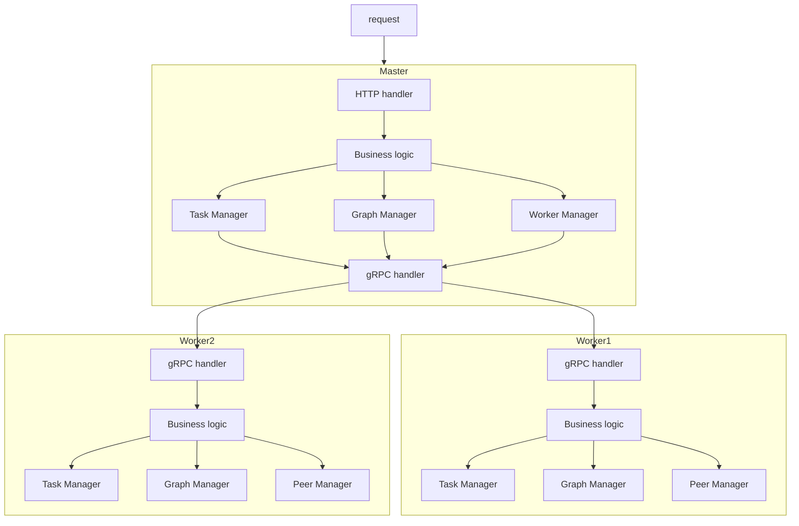
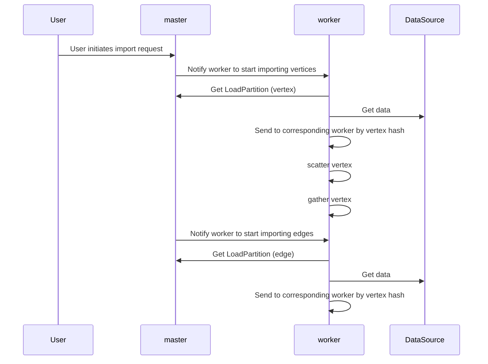
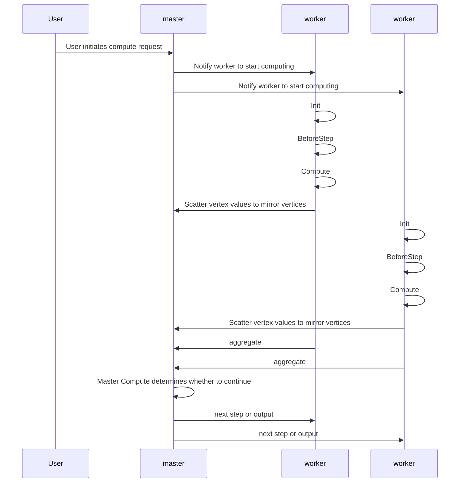

# Vermeer Architectural Design

## Running architecture

Vermeer has two roles: master and worker. There is only one master, but there can be multiple workers. The master is responsible for communication, forwarding, and summarizing, with a small amount of computation and low resource usage; the workers are computational nodes used for storing graph data and running computation tasks, consuming a large amount of memory and CPU. gRPC is used for internal communication, while REST is used for external calls.

## Load process

## Computing process

